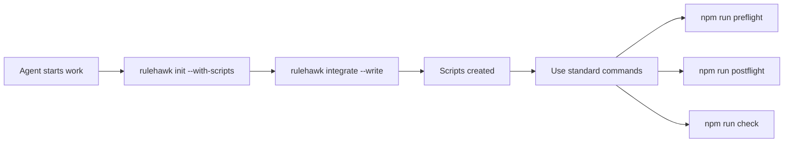

# RuleHawk Integration Flow

## The Complete Picture

RuleHawk becomes part of the project's standard workflow through automatic integration:



## How It Works

### 1. Agent Arrives at Project

```bash
# Agent detects RuleHawk in project
$ ls
rulehawk.yaml  package.json  src/

# Agent reads instructions in rulehawk.yaml
# Sees: "Run rulehawk integrate --write"
```

### 2. RuleHawk Creates Integration

```bash
$ rulehawk integrate

🦅 RuleHawk Integration Generator
📦 Project type: npm
--------------------------------------------------

Will add these scripts to package.json:
  "preflight": "rulehawk preflight"
  "postflight": "rulehawk postflight"
  "check": "rulehawk check"
```

### 3. Agent Uses Standard Commands

```javascript
// package.json after integration
{
  "scripts": {
    "test": "jest",
    "build": "webpack",
    "preflight": "rulehawk preflight",
    "postflight": "rulehawk postflight",
    "check": "rulehawk check",
    "pretest": "npm run preflight",
    "prebuild": "npm run check"
  }
}
```

### 4. Development Workflow

```bash
# Agent starts work
$ npm run preflight
🦅 Checking preflight rules...
✅ All checks passed

# Agent makes changes
$ edit src/app.js

# Before committing
$ npm run postflight
🦅 Checking postflight rules...
❌ Missing tests for new function
❌ Coverage dropped below 80%

# Agent fixes issues
$ npm test
$ npm run postflight
✅ All checks passed

# Safe to commit
$ git commit -m "Add new feature"
```

## The Learning Loop

### First Time: RuleHawk Learns

```bash
# RuleHawk doesn't know test command
$ npm run check

RuleHawk: "What command runs tests?"
Agent: "npm test"
RuleHawk: *saves to rulehawk/learned.json*
```

### Next Time: RuleHawk Knows

```bash
# RuleHawk remembers
$ npm run check
🦅 Running learned command: npm test
✅ All tests pass
```

## Project Types Supported

### Node.js Projects
```json
// package.json
"scripts": {
  "preflight": "rulehawk preflight",
  "postflight": "rulehawk postflight"
}
```

### Python Projects
```makefile
# Makefile
preflight:
	rulehawk preflight

postflight:
	rulehawk postflight
```

### Rust Projects
```toml
# .cargo/config.toml
[alias]
preflight = "!rulehawk preflight"
postflight = "!rulehawk postflight"
```

## Why This Approach Works

1. **Zero Learning Curve** - Agents use familiar commands (npm run, make)
2. **Project-Native** - Integration matches project's existing workflow
3. **Self-Documenting** - Scripts visible in package.json/Makefile
4. **CI/CD Ready** - Same commands work in pipelines
5. **Tool-Agnostic** - Works with any agent or human developer

## The Key Innovation

Instead of agents needing to know about RuleHawk commands, RuleHawk creates standard project commands that agents already know how to use.

```bash
# Instead of agents learning:
rulehawk preflight --output yaml --phase preflight

# They just use:
npm run preflight
```

## Complete Integration Example

```bash
# 1. Agent clones project
git clone repo
cd repo

# 2. Agent sees rulehawk.yaml
cat rulehawk.yaml
# Sees: "Run rulehawk integrate --write"

# 3. Agent runs integration
rulehawk integrate --write
# ✅ Updated package.json

# 4. Agent works normally
npm run preflight  # Before starting
npm test          # Regular testing
npm run postflight # Before commit

# 5. RuleHawk enforces quality silently
# Agent doesn't need to think about rules
```

## Summary

The genius of this approach:
- RuleHawk speaks the project's language (npm, make, cargo)
- Agents use commands they already know
- Rules are enforced without cognitive load
- Quality becomes automatic, not manual